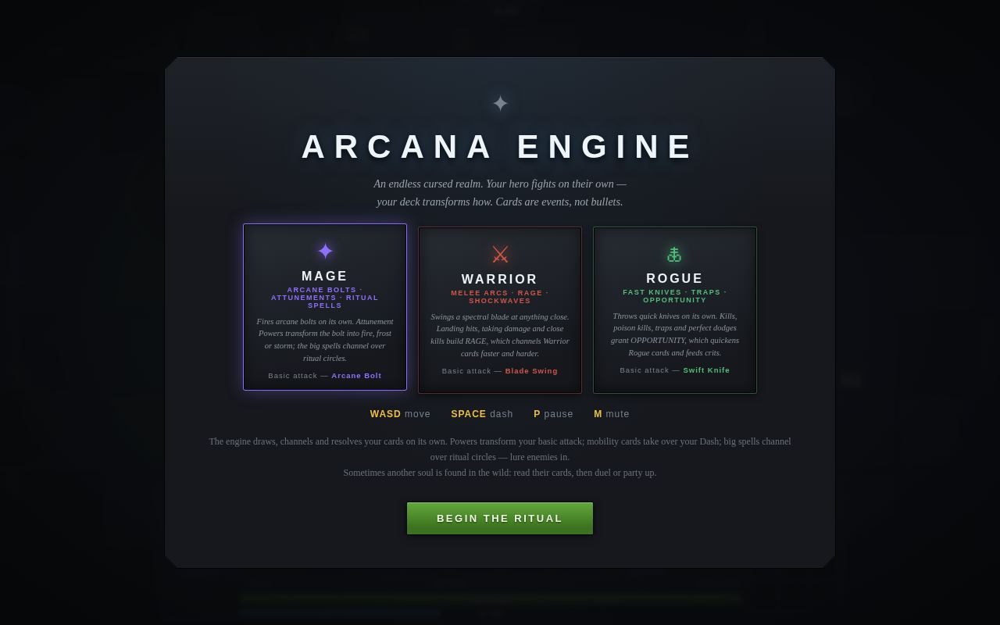
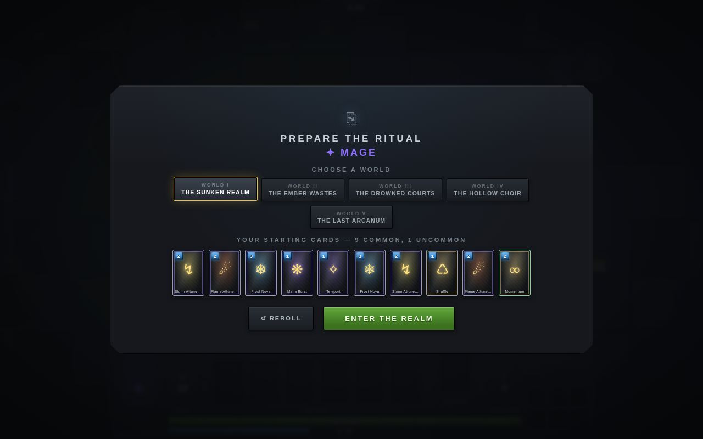
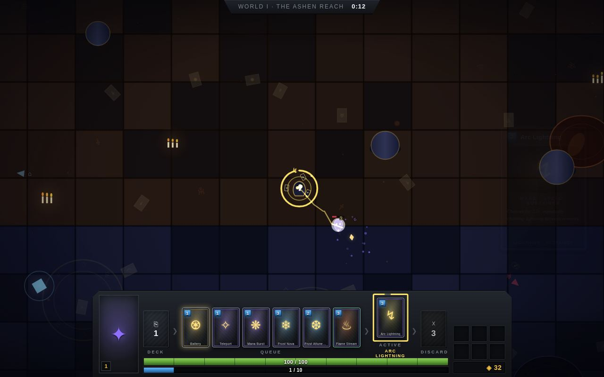
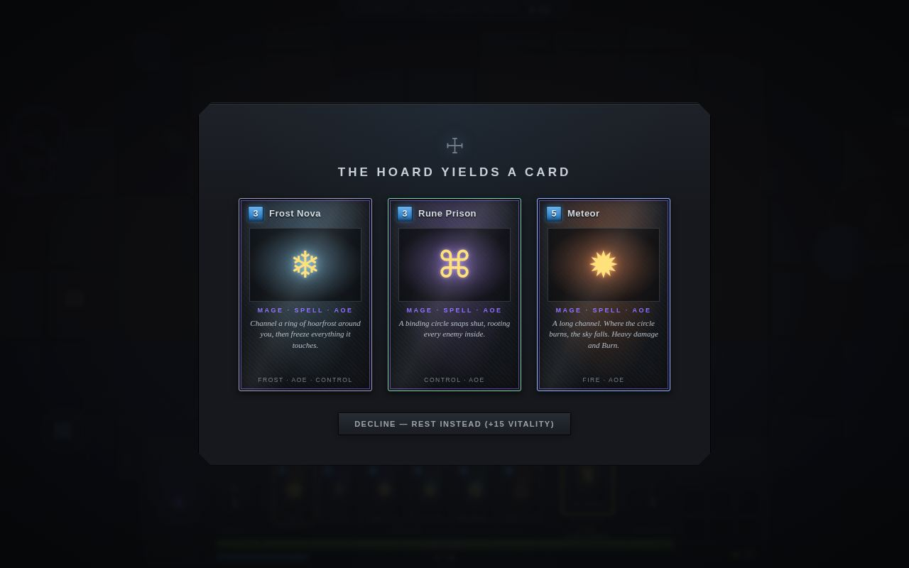
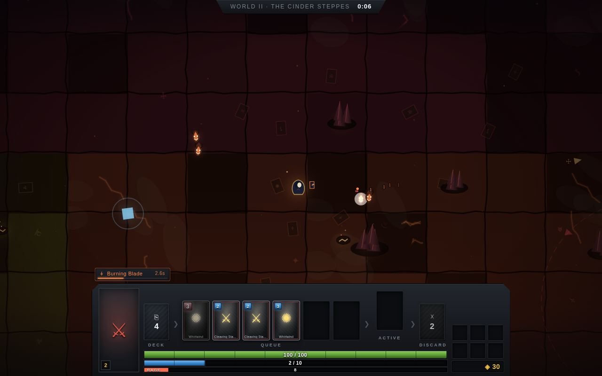
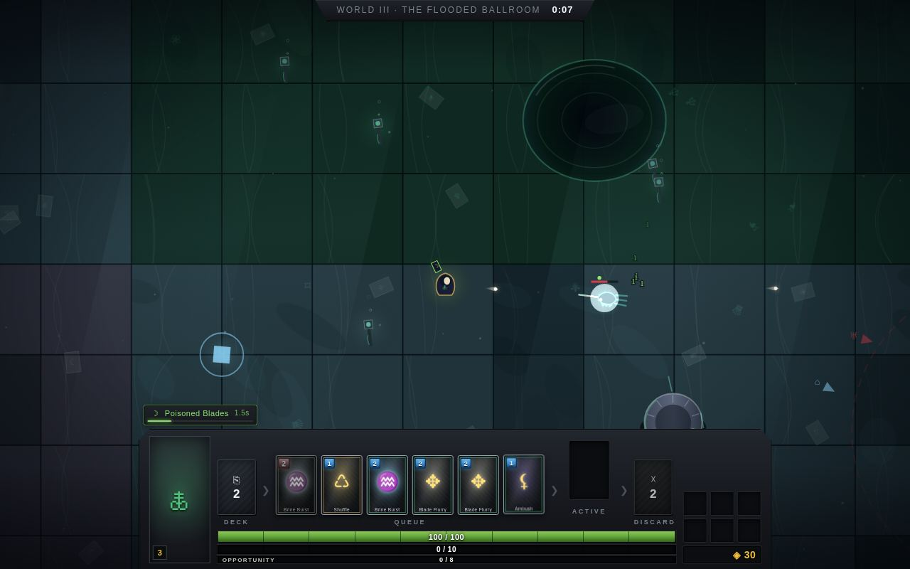
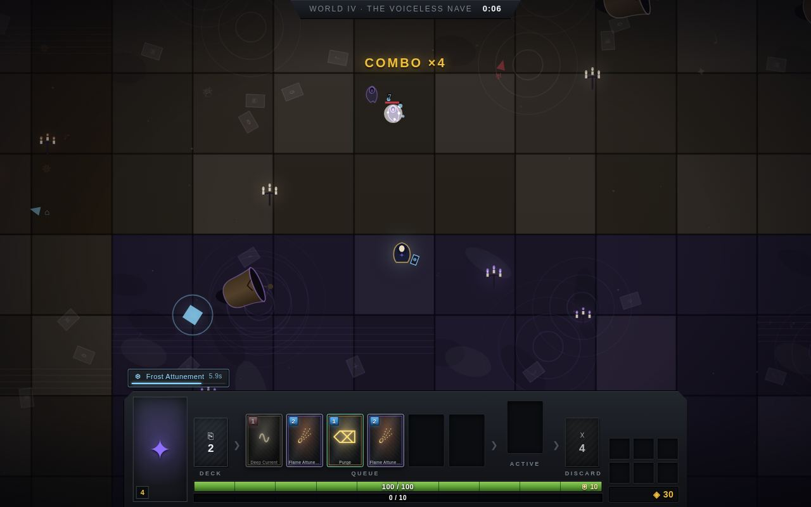
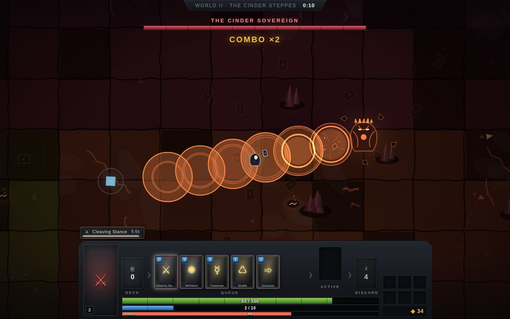
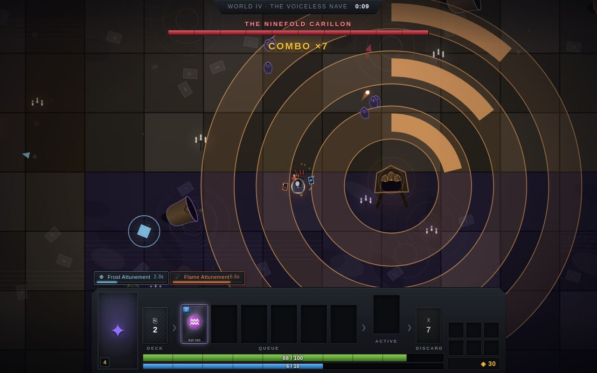
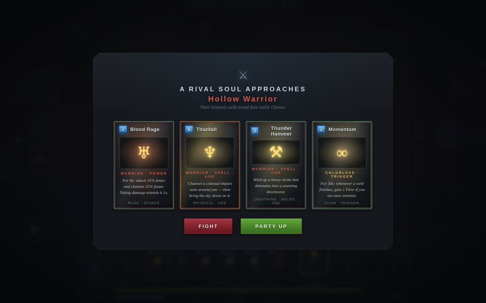

# Arcana Engine — Complete Game Specification

> **Design review dossier** · branch `rework` · Card System v2
>
> *"Your deck is alive. Your cards become reality."* — a real-time deck-building action roguelite where the hero fights on their own and the deck transforms **how**.
>
> Run it: `npm start` (Vite dev server). Every number in this document is sourced from the game's data files (`js/data/*`) and simulation code — file references included. A shareable web version with the same content lives at <https://claude.ai/code/artifact/e616607d-01a9-47fd-b265-d03c56cbe223>.

**At a glance:** 6 classes · 154 cards · 5 worlds · 12 bosses · 30 field enemies · 8 relics · 16 biomes

| § | Section |
|---|---|
| 1 | [What the game is](#1--what-the-game-is) |
| 2 | [Run structure & core loop](#2--run-structure--core-loop) |
| 3 | [The card engine](#3--the-card-engine) |
| 4 | [Classes & basic attacks](#4--classes--basic-attacks) |
| 5 | [Combat math](#5--combat-math) |
| 6 | [The two economies](#6--the-two-economies) |
| 7 | [Card library](#7--card-library--154-cards) |
| 8 | [Relics](#8--relics--permanent-run-modifiers) |
| 9 | [Worlds, threat & the map](#9--worlds-threat--the-procedural-map) |
| 10 | [Enemy roster](#10--enemy-roster) |
| 11 | [Twelve bosses](#11--twelve-bosses) |
| 12 | [Rival souls](#12--rival-souls--simulated-multiplayer) |
| 13 | [Sanctuaries](#13--sanctuaries) |
| 14 | [Meta-progression & drafts](#14--meta-progression--draft-weighting) |
| 15 | [Readability, UX & platform](#15--readability-ux--platform) |
| 16 | [Tech foundation](#16--tech-foundation) |
| 17 | [Observations & open questions](#17--observations--open-questions-for-review) |

---

## 1 · What the game is

**Genre.** Top-down real-time action roguelite crossed with an autonomous deck engine. The player owns exactly two verbs — **movement** and the **Dash** — plus one meta-verb: shaping the deck. Everything else (drawing, queuing, channeling, resolving cards, even the basic attack) runs itself. Cards are deliberately *slow, readable combat events*, not bullets: the design bet is that watching your engine come online while you steer the hero through telegraphed danger produces a strategy-under-pressure feel closer to an autobattler-piloting hybrid than to Vampire Survivors.

**Fantasy.** A "binder" of living cards descends through five increasingly cruel realms of an endless cursed world — drowned archive, dead forge, sunken aristocracy, hollow basilica, and a declared-but-unbuilt final arcanum. Tone is premium arcane fantasy: gilt on black, ritual circles, gold-foil legendaries.

**Session shape.** Endless-realm structure rather than stage-based: infinite procedural map per world, three boss gates to fall before the portal onward opens, difficulty ("threat") that never resets. A run ends only in death; meta-progression persists which worlds — and therefore which card sets — you have reached.


*Title screen. Class select is the first decision of a run; each class has its basic attack and resource summarized up front.*

**Design pillars** (from `roadmap.md`, enforced in code):

- **Cards shape the fight; they don't replace every hit.** The basic attack is the constant action layer and is explicitly not a card.
- **Readable rhythm.** No card resolves in under 0.3s unless it is a modifier/engine; every resolve is followed by a 0.55s "breath"; big spells telegraph with rune-circle previews.
- **No waiting screens.** Matchmaking that fails produces a guardian fight; a missed portal re-manifests near the player; drafts happen in-world.
- **Class identity through mechanics**, not stat deltas: Mana enables rituals, Rage rewards engagement, Focus rewards precision, Souls reward kills, Spirit rewards close combat, and Corruption rewards dangerous pressure.

## 2 · Run structure & core loop

```
Move → basic attack fires itself → build CLASS RESOURCE → cards auto-draw into the QUEUE
     → channel → resolve → reposition → repeat

Explore → camps / shrines / caches / sanctuaries → 3 boss gates → timed portal
        → next world (threat never resets) → … → death → new run
```

**Run setup.** Pick a class, then review its fixed **eight-card starting deck**. Any world you have reached can be selected as the starting world (`js/sim/run/lifecycle.ts`). Decks may grow to 12 cards, with at most two copies of one card and a six-card floor.


*"Prepare the Ritual." World select (all five worlds listed; reached worlds playable directly) above the fixed starting deck. Card frames show class-resource cost and school glyph.*

**Controls.** WASD/arrows to move · Space to dash (0.9s cooldown, 0.3s of i-frames — dodging through a hit scores a **Perfect Dodge**) · P/Esc pause · M mute. Mobility cards (Teleport, Shadowstep, Charge…) overwrite the Dash for ~8s. On touch devices: virtual joystick + dash and pause buttons.

**World progression.** Boss gates are sealed arenas (radius 430) scattered through the map; each world's gates cycle its three bosses in order, so no two consecutive gates stage the same fight. When the third boss of a world falls, a portal opens for **90 seconds** (timer pauses while sealed in a fight); if missed, it collapses and re-manifests **10s later, nearer the player** — a run can never be softlocked out of progressing. Entering heals +40 HP and resets the field but not threat. Death ends the run: stats screen, back to title.

## 3 · The card engine

The pipeline (`js/engine.js`, fully deterministic under a seeded RNG) is the game's heart: **Deck → Draw → Queue → Channel → Resolve / Stay Active → Discard → Reshuffle**. The player never casts manually; strategy is deck composition, positioning, and spending decisions made-for-you visible.

| Parameter | Value | Notes |
|---|---|---|
| Auto-draw interval | 1.0s | First draw 0.5s into the run; draw stops while the queue is full. |
| Queue capacity | 6 internal | The HUD exposes only the current card and next two cards. |
| Class resource | 0–10 | Each class has one named casting resource. Normal enabled cards cost 1–5; passive combat generation prevents indefinite stalls. |
| Post-resolve gap | 0.55s | The "breath" — deliberate readability pause between casts. |
| Combo | 4s window | Consecutive resolves chain a combo counter; every 5th link grants +2 Flow. |
| Channel time | 0.3–2.6s | Defined by card data and persistent buffs. Normal cards do not manipulate other cards or the queue. |

**Three player-facing card types:**

| Type | Timing | What it does |
|---|---|---|
| Power | short channel → 4–10s active | Visibly changes the character or basic attack. |
| Technique | fast | Provides defense, mobility, setup, or a targeted action. |
| Signature | medium to long | Creates a major attack, summon, or battlefield-control event. |


*The HUD in combat (Mage, World I). Bottom console: deck pile → six queue slots (cost badges; greyed = can't afford yet) → active slot → discard, over the HP bar (green), Flow bar (0/10) and gold. Above it: active Power badges with duration bars ("Frost Attunement 5.6s"), the Dash-override chip ("DASH → Teleport 7.5s") and Trigger chips ("Pyromancy 17s"). Top: biome label + run clock; combo counter center. Right: a card pop announcing the cast.*

## 4 · Classes & basic attacks

Player chassis is shared: `100 HP · speed 235 · radius 14 · dash 0.9s cd / 0.3s i-frames`. Class identity lives entirely in the basic attack and the resource (`js/data/classes.ts`, `js/sim/player.ts`).

| | ✦ Mage | ⚔ Warrior | 🜏 Rogue |
|---|---|---|---|
| **Identity** | Arcane bolts · Mana · Ritual spells | Melee arcs · Rage · Shockwaves | Fast knives · Traps · Focus |
| **Basic attack** | Arcane Bolt — 6 dmg · every 0.55s · range 470 · 600 u/s | Blade Swing — 10 dmg · every 0.8s · reach 125 · 100° arc · knockback 60 | Swift Knife — 5 dmg · every 0.4s · range 430 · 780 u/s · 10% base crit |
| **Resource** | **MANA (0–10)**: starts at 6; +1 every 1.1s in combat, +1 every fourth landed bolt, +2 on perfect dodge. | **RAGE (0–10)**: starts at 3; +1 every 2.5s in combat, every third landed swing, Armor block, health-damage event, and perfect dodge. Held Rage can add up to 50% basic damage. | **FOCUS (0–10)**: starts at 4; +1 every 1.7s in combat, critical hit, trap trigger, or poisoned kill; +2 on perfect dodge. Held Focus increases basic crit chance. |

| | ☠ Necromancer | ❧ Druid | ⛧ Warlock |
|---|---|---|---|
| **Identity** | Bone shards · Undead servants · Souls | Wild claws · Shapeshifting · Spirit | Eldritch bolts · Curses · Corruption |
| **Basic attack** | Bone Shard — 7 dmg · every 0.62s · range 460 · 560 u/s | Wild Claw — 9 dmg · every 0.7s · reach 115 · 90° arc · knockback 45 | Eldritch Bolt — 8 dmg · every 0.72s · range 500 · 520 u/s |
| **Resource** | **SOULS (0–10)**: starts at 4; +1 every 1.9s in combat, +1 per kill, +1 on perfect dodge. Held Souls add up to 40% basic damage. | **SPIRIT (0–10)**: starts at 5; +1 every 1.6s in combat, every third landed claw, and +2 on perfect dodge. Held Spirit adds up to 25% basic damage. | **CORRUPTION (0–10)**: starts at 4; +1 every 1.9s in combat, every fourth landed bolt, or health-damage event; +1 on perfect dodge. Held Corruption adds up to 40% basic damage; there is no automatic backlash. |

**Fixed starting decks** (the normal run-start path; eight cards, at most two copies):

| Class | Deck (8 cards) |
|---|---|
| **Mage** | Mana Burst ×2, Frost Nova ×2, Arc Lightning, Teleport, Rune Prison, Arcane Mirror |
| **Warrior** | Iron Skin ×2, Cleaving Stance, Charge, Whirlwind, Riposte, Thunder Hammer, Execute |
| **Rogue** | Poisoned Blades ×2, Shadowstep, Springblade Trap, Backstab, Smoke Bomb, Deathmark, Fan of Knives |
| **Necromancer** | Bone Legion ×2, Raise Dead, Bone Spear, Grave Grasp, Soul Ward, Plague Ground, Wraith Walk |
| **Druid** | Wolf Aspect ×2, Bear Aspect, Pounce, Barkskin, Renewal, Entangling Roots, Hurricane |
| **Warlock** | Fel Infusion ×2, Cursed Bolts, Shadow Barrage, Hellfire, Demon Skin, Fear, Life Drain |

## 5 · Combat math

**Statuses** (stacking; duration refreshes on reapply):

| Status | DPS / stack | Duration | Notes |
|---|---:|---:|---|
| Burn | 3.0 | 3s | Fire school currency; triggers Pyromancy / Ember Seal. |
| Poison | 1.6 | 6s | Rogue and Necromancer setup; poisoned kills grant +1 Focus to Rogue. |
| Bleed | 2.2 | 4s | Pure damage, no synergy hooks yet. |
| Chill | 0 | 2.2s | Flat 50% slow. **Bosses/rivals cap at 1 stack** — the only status with a boss safeguard. |

**Rules that matter:**

- **Crits** deal ×2 and come from card specs, held Focus, Deathmark/Ambush, and Shadowstep empowerment. Enemy damage cannot crit.
- **Armor** is a flat consumable shield (Shield Wall 25, Iron Skin 12…), absorbing damage 1:1 before HP; blocking feeds Warrior Rage. No cap in code — armor stacks indefinitely.
- **Deathmark**: marked enemy takes ×1.35 damage and +25% crit chance from you for 8s.
- **Control**: freeze and stun halt enemies entirely; root pins in place but lets them attack; knockback is physics velocity. All of these *do* work on bosses.
- **Perfect Dodge** (i-frame passes through a hit): restores the class-specific amount (1–2), triggers 0.22s slow-motion, and feeds reactive Powers.
- **Player i-frames**: 0.5s after taking a hit; enemy contact re-hits every 0.8s; ground hazards tick every 0.55s standing inside.
- **Card levels** (★, via Sanctuary combining, max Lv.3): **+25% damage, +8% area, +15% durations per star**.
- **Hitstop & shake**: elite/boss kills freeze the sim ~0.09s; screenshake budgeted per effect — juice is code-driven, not sprite-driven.

## 6 · The two economies

**Flow** (casting fuel — the moment-to-moment economy):

| Source | Amount | Notes |
|---|---|---|
| Shard pickups | +1 | Every enemy drops 1–3 shards (elites 10, bosses 12–26); magnetized within 120 px. |
| Perfect dodge | +1 or +2 | Amount is defined per class; Mage, Rogue, and Druid gain 2, while Warrior, Necromancer, and Warlock gain 1. |
| Living dangerously | +1 / 2s | Continuous while an enemy is within 230 px — rewards fighting close, punishes kiting at range. |
| Combo | +2 | Every 5th resolve inside a rolling 4s chain. |
| Flow shrine | +3 | Map feature, 12s per-shrine cooldown. |
| Duel victory | +5 | Plus the card claim, gold and heal (§12). |
| Cards & relics | varies | Battery, Mana Burst (+1/enemy hit), Metronome, Momentum, Ember Seal… |
| Drawing cards | 0 | Deliberately grants nothing — draw is tempo, not income. |

**Gold ◈** (the run economy):

| Source / sink | Amount | Notes |
|---|---|---|
| Run start | 30 | One Common at the first merchant. |
| Kills | 1–2 (30%) | Elites & rivals always drop 6. |
| Camp cleared | +15 | Plus 5 shards and a 50% card draft. |
| Treasure cache | +15 | On the 40% branch that isn't a card draft (also +10 HP, 6 shards). |
| Boss gate | +40 | Plus a relic draft and +30 HP. |
| Duel won | +30 | |
| Card prices | 25 / 40 / 70 / 120 | Common / Uncommon / Rare / Legendary at any merchant. |
| Selling | ½ price + 15·★ | Never below a 6-card deck. |

## 7 · Card library — 154 cards

Every card is pure data flowing through one effect resolver (`js/sim/effects/`). The registry contains 154 cards for migration compatibility; Card System v2 enables a focused pool of 60 cards—ten per class—and excludes Colorless and queue-manipulation cards from normal pools. Authored-world cards remain registered for later adaptation.

| School | Common | Uncommon | Rare | Legendary | Total |
|---|---:|---:|---:|---:|---:|
| Mage | 10 | 11 | 6 | 1 | **28** |
| Warrior | 10 | 11 | 4 | 1 | **26** |
| Rogue | 9 | 13 | 5 | 1 | **28** |
| Necromancer | 7 | 5 | 2 | 1 | **15** |
| Druid | 6 | 6 | 2 | 1 | **15** |
| Warlock | 6 | 6 | 2 | 1 | **15** |
| Colorless | 8 | 13 | 2 | 4 | **27** |
| **Total** | 56 | 65 | 23 | 10 | **154** |


*A draft. Three weighted options (§14); declining is a real choice — "rest instead" heals +15 HP.*

<details>
<summary><b>Mage</b> — 16 cards · base set — attunements, control, ritual AoE</summary>

| Card | Rarity | Type | Flow | Channel | Effect |
|---|---|---|---:|---:|---|
| ☄ **Flame Attunement** | Common | Power | 2 | 0.6s | For 8s your bolts become small Fireballs that explode and apply Burn. |
| ❆ **Frost Attunement** | Common | Power | 2 | 0.6s | For 8s your bolts become Frost Bolts that Chill and slow enemies. |
| ↯ **Storm Attunement** | Common | Power | 2 | 0.6s | For 8s your bolts chain lightning to up to 2 nearby enemies. |
| ⧉ **Arcane Mirror** | Uncommon | Power | 2 | 0.5s | For 10s, every third basic attack fires an extra bolt at another enemy. |
| ✹ **Meteor** | Rare | Spell · AoE | 5 | 2.4s | A long channel. Where the circle burns, the sky falls. Heavy damage and Burn. |
| ❄ **Frost Nova** | Common | Spell · AoE | 3 | 1.6s | Channel a ring of hoarfrost around you, then freeze everything it touches. |
| ⌘ **Rune Prison** | Uncommon | Spell · AoE | 3 | 1.5s | A binding circle snaps shut, rooting every enemy inside. |
| ↯ **Arc Lightning** | Common | Spell · Sustained | 3 | 0.9s | Channel for 2.5s, repeatedly chaining lightning between enemies. |
| ♨ **Flame Stream** | Uncommon | Spell · Sustained | 3 | 0.8s | Channel for 3s, continuously spraying flames toward enemies. |
| ❄ **Blizzard** | Uncommon | Spell · AoE | 4 | 1.8s | Conjure a frozen storm that gnaws and chills all inside it for 4s. |
| ❋ **Mana Burst** | Common | Skill | 1 | 0.5s | A pulse of raw arcana. Gain 1 Flow for each enemy struck. |
| ✧ **Teleport** | Common | Skill | 1 | 0.5s | For 8s your Dash becomes Teleport: fold space in your movement direction. |
| ☯ **Elemental Cycle** | Rare | Engine | 2 | 0.6s | For 30s: whenever a Mage Power expires, a different Attunement is queued for free. |
| ♕ **Pyromancy** | Uncommon | Trigger | 2 | 0.6s | For 25s: whenever Burn is applied, a small burst of fire erupts there. |
| ⌛ **Time Warp** | Rare | Engine | 2 | 0.4s | For 6s, all channeling runs at double speed. |
| ✦ **Arcane Singularity** | Legendary | Spell · AoE | 6 | 2.6s | Channel a collapsing star. Everything inside is dragged in, rooted, and unmade. |

</details>

<details>
<summary><b>Warrior</b> — 14 cards · base set — stances, armor, shockwaves</summary>

| Card | Rarity | Type | Flow | Channel | Effect |
|---|---|---|---:|---:|---|
| ⚔ **Cleaving Stance** | Common | Power | 2 | 0.5s | For 7s your swings carve a far wider arc and hit 25% harder. |
| ⸸ **Burning Blade** | Common | Power | 2 | 0.5s | For 7s your swings ignite, applying Burn on every hit. |
| ♅ **Blood Rage** | Uncommon | Power | 2 | 0.5s | For 8s: attack 35% faster and channel 25% faster. Taking damage extends it 1s. |
| ➶ **Charge** | Common | Skill | 2 | 0.5s | For 8s your Dash becomes Charge: crash through enemies, dragging them with you. |
| ⛨ **Shield Wall** | Common | Skill | 2 | 0.5s | Raise a rampart of golden wards. Gain 25 Armor. |
| ❖ **Iron Skin** | Common | Skill | 1 | 0.5s | Your skin turns to living iron. Gain 12 Armor. |
| ⚒ **Thunder Hammer** | Uncommon | Spell · AoE | 3 | 1.1s | Wind up a heavy strike that detonates into a stunning shockwave. |
| ✺ **Whirlwind** | Common | Spell · Sustained | 3 | 0.7s | Spin for 2s, repeatedly slashing everything around you. |
| ♁ **Earthquake** | Rare | Spell · AoE | 4 | 2s | Long channel. The floor splits in a shockwave that stuns all around you. |
| ☠ **Execute** | Uncommon | Skill | 3 | 0.5s | A merciless strike. Deals 3.5× damage to enemies below 35% health. |
| ⚚ **Throw Axe** | Common | Skill | 2 | 0.5s | Hurl a spinning axe that pierces enemies and returns to your hand. |
| ☍ **Riposte** | Uncommon | Trigger | 2 | 0.5s | For 25s: after a perfect dodge, a counter slash strikes nearby enemies. |
| ♯ **Battle Cry** | Uncommon | Modifier | 2 | 0.5s | Your next 3 Warrior cards deal 50% more damage. |
| ♆ **Titanfall** | Legendary | Spell · AoE | 6 | 2.2s | Channel a colossal impact zone around you — then bring the sky down on it. |

</details>

<details>
<summary><b>Rogue</b> — 16 cards · base set — poison, traps, crits, knives</summary>

| Card | Rarity | Type | Flow | Channel | Effect |
|---|---|---|---:|---:|---|
| ☽ **Poisoned Blades** | Common | Power | 2 | 0.5s | For 7s your knives drip venom, applying Poison on every hit. |
| ⌁ **Serrated Blades** | Common | Power | 2 | 0.5s | For 7s your knives tear flesh, applying Bleed on every hit. |
| ☾ **Shadowstep** | Common | Skill | 1 | 0.5s | For 8s your Dash becomes Shadowstep: blink untargetable, empowering your next basic attack. |
| ⚸ **Springblade Trap** | Common | Skill | 2 | 0.5s | Place a hidden trap. Once armed, it snaps shut on the first enemy to step in. |
| ♒ **Smoke Bomb** | Uncommon | Skill | 2 | 0.5s | A choking cloud follows you, slowing enemies inside it. |
| ⸙ **Backstab** | Uncommon | Skill | 2 | 0.5s | A treacherous strike with a 50% critical chance. |
| ♃ **Venom Cloud** | Uncommon | Spell · AoE | 3 | 1.5s | A lingering cloud that steadily poisons everything within for 5s. |
| ✥ **Fan of Knives** | Uncommon | Spell · Sustained | 3 | 0.7s | For 2s, release wave after wave of spectral knives in every direction. |
| ❂ **Knife Storm** | Rare | Spell · Sustained | 5 | 1.2s | A 2.4s hurricane of spectral knives spirals out around you. |
| ♰ **Deathmark** | Uncommon | Modifier | 2 | 0.4s | Mark the nearest enemy for 8s. It takes 35% more damage and +25% crits from you. |
| ☣ **Toxic Reaction** | Uncommon | Trigger | 2 | 0.6s | For 30s: when a Poisoned enemy dies, its Poison spreads to nearby enemies. |
| ♞ **Evasion** | Uncommon | Trigger | 1 | 0.4s | For 25s: perfect dodges draw one card (but grant no Flow). |
| ⚸ **Ambush** | Common | Modifier | 1 | 0.3s | The next Rogue card gains +75% critical chance and 20% damage. |
| ⚉ **Shadow Clone** | Rare | Spell · Sustained | 3 | 0.9s | A clone of living shadow fights beside you for 8s, throwing knives. |
| ✥ **Blade Flurry** | Common | Spell · Sustained | 2 | 0.6s | For 1.5s, quick rings of knives whirl out around you. |
| ❈ **Thousand Cuts** | Legendary | Spell · Sustained | 6 | 1.2s | For 3s the air itself is made of knives. They remember every wound. |

</details>

<details>
<summary><b>Colorless</b> — 14 cards · base set — queue & Flow engine glue</summary>

| Card | Rarity | Type | Flow | Channel | Effect |
|---|---|---|---:|---:|---|
| ⎘ **Draw** | Common | Engine | 0 | 0.3s | Draw one card into the queue. Grants no Flow. |
| ⟢ **Extend** | Uncommon | Engine | 1 | 0.4s | Your active Powers last 4 seconds longer. |
| ➾ **Quickcast** | Common | Modifier | 1 | 0.3s | The next Spell channels 50% faster but loses 20% power. |
| ⌖ **Grand Channel** | Uncommon | Modifier | 2 | 0.4s | The next Spell channels 60% longer but gains +70% power and +25% area. |
| ⧠ **Duplicate** | Uncommon | Engine | 2 | 0.4s | Copy the next card in the queue. The copy costs 1 more Flow. |
| ⇶ **Flush Queue** | Rare | Engine | 3 | 0.7s | Golden energy floods the queue: the queued cards channel at triple speed, while Flow lasts. |
| ⟳ **Echo** | Uncommon | Engine | 2 | 0.4s | Return the last resolved card to the queue at +1 Flow cost. |
| ♼ **Battery** | Common | Engine | 1 | 0.6s | Store momentum: gain 5 Flow over 3 seconds. |
| ♺ **Shuffle** | Common | Engine | 1 | 0.3s | Immediately shuffle the discard pile back into the deck. |
| ⌫ **Purge** | Uncommon | Engine | 1 | 0.4s | Discard the current queue; gain half its total Flow cost back. |
| ⚶ **Overload** | Uncommon | Modifier | 2 | 0.4s | The next Spell costs double Flow but deals 120% more damage in a wider area. |
| ⚖ **Stabilize** | Common | Engine | 1 | 0.4s | Gain 5 Armor — or 16 if a Power is active. |
| ∞ **Momentum** | Uncommon | Trigger | 2 | 0.5s | For 30s: whenever a card finishes, gain 1 Flow if you are near enemies. |
| ☩ **Grand Flush** | Legendary | Engine | 6 | 1.2s | Channel briefly, then the entire queue channels at triple speed for half Flow cost. |

</details>

<details>
<summary><b>World II — The Ember Wastes</b> — 17 cards · fire, burn, slag</summary>

| Card | Rarity | Type | Flow | Channel | Effect |
|---|---|---|---:|---:|---|
| 🜂 **Phoenix Attunement** (W-II) | Uncommon | Power | 3 | 0.6s | For 8s your bolts become phoenix fire: bigger blasts, deeper Burn. |
| ☀ **Solar Lance** (W-II) | Rare | Spell · AoE | 4 | 1.6s | Channel a lance of dawn, then pierce everything in a line. |
| ✹ **Cinder Storm** (W-II) | Uncommon | Spell · Sustained | 4 | 0.9s | For 3s, a storm of embers sprays toward your enemies. |
| ♒ **Ash Veil** (W-II) | Common | Skill | 2 | 0.5s | A cloak of ash follows you, slowing enemies. Gain 10 Armor. |
| ♨ **Magma Stance** (W-II) | Uncommon | Power | 3 | 0.5s | For 7s your swings arc wider, hit harder, and set flesh alight. |
| ⛰ **Eruption** (W-II) | Rare | Spell · AoE | 4 | 1.9s | The ground splits and the mountain answers: heavy damage, Burn, and a blastwave. |
| ➶ **Molten Charge** (W-II) | Uncommon | Skill | 2 | 0.5s | For 8s your Dash becomes Molten Charge: drag enemies through fire. |
| ⚒ **Tempered Will** (W-II) | Common | Skill | 2 | 0.5s | Forge yourself anew: gain 18 Armor and 3 Flow over 2 seconds. |
| 🜏 **Ember Blades** (W-II) | Uncommon | Power | 3 | 0.5s | For 7s: knives fly 20% faster, burn on hit, and crit more often. |
| ⚸ **Firetrap** (W-II) | Uncommon | Skill | 2 | 0.5s | A buried ember charge: snaps shut with fire on the first enemy in. |
| ❂ **Mirage Storm** (W-II) | Rare | Spell · Sustained | 4 | 1s | For 2.4s, waves of mirage knives shimmer out in every direction. |
| ♒ **Ash Bomb** (W-II) | Common | Skill | 2 | 0.6s | A smothering cloud of hot ash: slows and singes everything inside. |
| ⚙ **Gilded Engine** (W-II) | Uncommon | Engine | 1 | 0.5s | Gain 4 Flow over 1.5s and draw one card. |
| 🜂 **Phoenix Echo** (W-II) | Uncommon | Trigger | 2 | 0.5s | For 30s: whenever a Power expires, gain 3 Flow from its ashes. |
| ☿ **Transmute** (W-II) | Common | Engine | 1 | 0.4s | Draw two cards into the queue. Grants no Flow. |
| ❂ **Worldheart** (W-II) | Rare | Engine | 3 | 0.7s | Draw on the realm itself: 15 Armor and 6 Flow over 4 seconds. |
| ☩ **Worldfire** (W-II) | Legendary | Spell · AoE | 6 | 2s | Set the realm itself alight: a vast burning field, and 6 Flow as it feeds you. |

</details>

<details>
<summary><b>World III — The Drowned Courts</b> — 16 cards · frost, chill, tide</summary>

| Card | Rarity | Type | Flow | Channel | Effect |
|---|---|---|---:|---:|---|
| ♆ **Tide Attunement** (W-III) | Uncommon | Power | 3 | 0.6s | For 8s your bolts become the tide: they pass through one body and Chill the next. |
| ⏚ **Crush Depth** (W-III) | Rare | Spell · AoE | 4 | 1.8s | The pressure of the deep sea arrives all at once: heavy damage, a moment frozen, and Chill. |
| 🌀 **Maelstrom** (W-III) | Uncommon | Spell · Sustained | 4 | 0.9s | For 3s the sea turns around you, battering everything it can reach outward. |
| ☽ **Still Water** (W-III) | Common | Skill | 2 | 0.5s | One held breath: everything near you stops moving for a beat. |
| ≋ **Breaker Stance** (W-III) | Uncommon | Power | 3 | 0.5s | For 7s you swing like surf on rock: wider, harder, and everything struck is Chilled. |
| ⛆ **Breach** (W-III) | Rare | Spell · AoE | 4 | 1.9s | The seafloor heaves and throws the court off its feet: heavy damage and a long shove. |
| ➾ **Undertow Rush** (W-III) | Uncommon | Skill | 2 | 0.5s | For 8s your Dash becomes the undertow: drag enemies with you, chilled to the bone. |
| ⚓ **Drowned Resolve** (W-III) | Common | Skill | 2 | 0.5s | What the sea could not kill, the court cannot: gain 16 Armor and 4 Flow over 2.5s. |
| ❖ **Pearl Knives** (W-III) | Uncommon | Power | 3 | 0.5s | For 7s: knives of cold nacre — faster, sharper, and every cut Chills. |
| ⚸ **Drowning Snare** (W-III) | Uncommon | Skill | 2 | 0.5s | A noose of cold water under the tiles: holds the first enemy in and Chills the rest. |
| ☄ **Squall** (W-III) | Rare | Spell · Sustained | 4 | 1s | For 2.4s, sheets of sleet-knives lash out in every direction. |
| ♒ **Brine Burst** (W-III) | Common | Skill | 2 | 0.6s | A shattered flask of the cold deep: a pool that slows and Chills everything wading in it. |
| ☾ **Ebb and Flow** (W-III) | Uncommon | Engine | 1 | 0.5s | The tide goes out and comes back richer: 5 Flow over 2.5s and draw one card. |
| ≈ **Slipstream** (W-III) | Uncommon | Trigger | 2 | 0.5s | For 30s: whenever you Dash, the current carries you — gain 2 Flow. |
| ∿ **Deep Current** (W-III) | Common | Engine | 1 | 0.4s | Draw one card and gain 2 Flow as the current passes through you. |
| ☩ **Worldflood** (W-III) | Legendary | Spell · AoE | 6 | 2s | Let the sea back in: a vast drowning field that slows and Chills, and 6 Flow as it rises. |

</details>

<details>
<summary><b>World IV — The Hollow Choir</b> — 16 cards · storm, resonance, silence</summary>

| Card | Rarity | Type | Flow | Channel | Effect |
|---|---|---|---:|---:|---|
| ♫ **Resonant Attunement** (W-IV) | Uncommon | Power | 3 | 0.6s | For 8s your bolts are struck, not cast: each hit rings on into two nearby bodies. |
| ⚡ **Thunderclap** (W-IV) | Rare | Spell · AoE | 4 | 1.8s | The loudest thing left in the world, delivered once: heavy damage and a stunned beat of silence. |
| ∿ **Standing Wave** (W-IV) | Uncommon | Spell · Sustained | 4 | 0.9s | For 3s you hold one note and the air keeps breaking on it: arcs leap to whoever is nearest. |
| ♪ **Grace Note** (W-IV) | Common | Skill | 2 | 0.5s | One small note, perfectly placed: a crack of sound and the next card falls into your hand. |
| ⚶ **Bellringer's Stance** (W-IV) | Uncommon | Power | 3 | 0.5s | For 7s you swing like a struck bell: wider, harder, and the whole yard hears it. |
| ☩ **Ninefold Knell** (W-IV) | Rare | Spell · AoE | 4 | 1.9s | You ring the ground itself: heavy damage, a stunned beat, and everything thrown off the note. |
| ➾ **Processional** (W-IV) | Uncommon | Skill | 2 | 0.5s | For 8s your Dash is a procession: the crowd is gathered up and carried down the aisle with you. |
| ♏ **Rebuke** (W-IV) | Common | Skill | 2 | 0.5s | Answer before you are asked: 14 Armor, and everything within reach is shoved off the verse. |
| ❖ **Knife Canon** (W-IV) | Uncommon | Power | 3 | 0.5s | For 7s your knives sing in canon: faster, keener, and every fourth throw answers itself. |
| ⚸ **Silent Snare** (W-IV) | Uncommon | Skill | 2 | 0.5s | A pocket of borrowed silence under the tiles: the first thing to break it is held for the verdict. |
| ☄ **Ricochet Aria** (W-IV) | Rare | Spell · Sustained | 4 | 1s | For 2.4s every knife leaves on the beat and comes back on the off-beat. |
| ☽ **Curtain Call** (W-IV) | Common | Skill | 2 | 0.4s | Vanish into the applause: blink away untouchable, and take a bow worth 2 Flow. |
| ≑ **Call and Answer** (W-IV) | Uncommon | Trigger | 2 | 0.5s | For 30s: whenever a card resolves, the choir answers — gain 1 Flow. |
| 𝄽 **The Grand Rest** (W-IV) | Uncommon | Skill | 2 | 0.5s | One bar of silence, observed by everyone: everything near you holds perfectly still. |
| ◭ **Metronome** (W-IV) | Common | Engine | 1 | 0.4s | It keeps time so you don’t have to: 4 Flow, delivered strictly on the beat. |
| 𝄞 **The Lost Chord** (W-IV) | Legendary | Spell · AoE | 6 | 2s | The note the choir died looking for. Play it once: the world stops arguing, and you draw two. |

</details>


## 8 · Relics — permanent run modifiers

Awarded as a pick-one-of-three from every boss gate. The pool is **8 total, no duplicates** — a single world's three gates already consume most of it (see §17).

| Relic | Effect |
|---|---|
| ✒ **Golden Quill** | Whenever the queue empties, draw one card. |
| ❉ **Ember Seal** | Applying Burn has a 25% chance to grant 1 Flow. |
| ♾ **Astral Battery** | Maximum Flow increased by 4. |
| ⸸ **Assassin's Needle** | When a Poisoned enemy dies, your next card channels 50% faster. |
| ⌛ **Cracked Hourglass** | Channel times +25%, but AoE radius +35%. |
| ✊ **Duelist's Glove** | Warrior cards deal 60% more damage while the queue holds at most 1 card. |
| ⟢ **Eternal Sigil** | Your Powers last 30% longer. |
| ❂ **Prismatic Codex** | Card drafts may offer cards from every school. |

## 9 · Worlds, threat & the procedural map

| World | Threat | Theme | Biomes | Bosses | Status |
|---|---|---|---|---|---|
| World I — THE SUNKEN REALM | ×1 | arcane | The Sunken Archive, The Ashen Reach, The Blighted Garden, The Umbral Fen | The Gilded Librarian · The Ink Leviathan · The Unwritten King | fully authored |
| World II — THE EMBER WASTES | ×1.9 | ember | The Cinder Steppes, The Obsidian Flats, The Sulfur Fens, The Endless Pyre | The Cinder Sovereign · The Slagheart Colossus · The Pyre Matriarch | fully authored |
| World III — THE DROWNED COURTS | ×2.9 | abyss | The Flooded Ballroom, The Kelp Gardens, The Pearl Mausoleum, The Abyssal Trench | The Sunless Queen · The Undertow Regent · The Weeping Reliquary | fully authored |
| World IV — THE HOLLOW CHOIR | ×4.1 | requiem | The Voiceless Nave, The Singing Ossuary, The Toppled Belfry, The Organum Deep | The Ninefold Carillon · The Antiphon · The Grand Silence | fully authored |
| World V — THE LAST ARCANUM | ×5.5 | requiem | The Voiceless Nave, The Singing Ossuary, The Toppled Belfry, The Organum Deep | The Ninefold Carillon · The Antiphon · The Grand Silence | ⚠ declared — reuses W-IV content |


*World II — ember theme. Cracked basalt lit from below; Warrior with RAGE bar visible.*


*World III — abyss theme. Pale flooded marble; Reef Urchin turret bottom-right, Rogue OPPORTUNITY pips in console.*

**Threat — the one difficulty dial:**

```
threat = (1 + runTime/55 + kills/50 + distanceFromOrigin/3800) × worldMultiplier

ambient budget  = min(4 + 1.6·threat, 16) concurrent enemies, spawned every 1–2.6s
enemy HP        × (1 + (threat−1)·0.12)
boss HP         × (0.75 + threat·0.12 / worldMultiplier)
enemies beyond 1700 px are culled
```

Time, kills and distance **carry across worlds** — the curve never resets, only the multiplier jumps. Enemy tiers gate on threat (e.g. Ash Stalkers join at 2.5, Kiln Wardens at 5.5), so composition hardens alongside HP.

| World | Spawn tiers (weight, threat gate) |
|---|---|
| W-I | Ink Wisp (w10) · Glyph Sentinel (w5, threat≥1.4) · Tome Horror (w4, threat≥1.9) · Cursed Knight (w3, threat≥2.8) · Gilded Custodian (w1, threat≥4.5) |
| W-II | Ember Imp (w9) · Magma Maw (w4) · Obsidian Shardling (w5, threat≥1.2) · Brimstone Vent (w3, threat≥2) · Ash Stalker (w4, threat≥2.5) · Cinder Ram (w3, threat≥3.2) · Bellows Cantor (w2, threat≥3.8) · The Kiln Warden (w1, threat≥5.5) |
| W-III | Pallid Courtier (w9) · Brine Mote (w4) · Court Siren (w4, threat≥1.2) · Tide Lancer (w4, threat≥2) · Reef Urchin (w3, threat≥2.4) · Undertow Maw (w3, threat≥3) · Grief Chorister (w2, threat≥3.6) · The Tidebound Seneschal (w1, threat≥5.5) |
| W-IV | Hollowed Votary (w9) · Ringing Penitent (w4) · Hymn Lector (w4, threat≥1.2) · Bell-Sexton (w4, threat≥2) · Funeral Toll (w3, threat≥2.4) · Reverberant Shade (w3, threat≥3) · Hollow Chorus (w2, threat≥3.6) · The Hollow Maestro (w1, threat≥5.5) |

**Map generation** (chunk = 560 px, seeded per run):

| Feature | Chance / chunk | Min distance | What it is |
|---|---:|---:|---|
| Flow shrine | 6% | 1 chunk | +3 Flow on touch, 12s cooldown. One guaranteed at spawn. |
| Enemy camp | 11% | 2 chunks | r230 lair; engages within 240 px of its edge; composition scales with threat, elites 40% at high tiers. Clear: +15◈, shards, 50% draft. |
| Treasure cache | 5% | 1 chunk | 60% a card draft; else +15◈, +10 HP, shards. |
| Sanctuary | 5.5% | 2 chunks | Warded hearth — see §13. |
| Boss gate | 3.5% | 4 chunks | Landmark; walking into its r430 zone seals the arena and stages the world's next boss in the cycle. |
| Hazard pools / pillars | 22–30% | — | Pools slow to 60% speed; pillars are hard collision. Density varies by world theme. |

> Sealed arenas are a promise the code keeps: on gate or duel start, all lesser enemies are dismissed (not killed — no loot, camps re-arm) and the fight inside is the whole fight.

## 10 · Enemy roster

Every world re-teaches the roster around its mechanical theme: World I is telegraph literacy, World II is *heat* (death-bursts, artillery, floor fire), World III is *the tide* (pulls, vortices, healers — the first world that attacks your position rather than your HP), World IV is *the echo* (strikes landing where you *were*; its one rule — never stand where you already stood).

### World I — The Sunken Realm

| Enemy | Role | HP | Speed | Touch | Shards | Behavior |
|---|---|---:|---:|---:|---:|---|
| **Ink Wisp** | swarm | 14 | 118 | 8 | 1 | Contact chaser; the baseline body of World I. |
| **Glyph Sentinel** | sniper | 24 | 72 | 10 | 1 | Kites at 320 range, aimed bolt every 2.3s (slow 250 u/s projectile — dodgeable on reaction). |
| **Tome Horror** | exploder | 18 | 132 | 22 | 1 | Rushes in, 1.0s fuse, r95 blast for 22. |
| **Cursed Knight** | tank | 60 | 55 | 14 | 2 | Telegraphed lunge (0.65s tell, 460 u/s) from 180 range. |
| **Gilded Custodian** *(elite)* | elite | 210 | 62 | 18 | 6 | Elite. Lunges + r170 shockwave every 5s (1.0s tell, 16 dmg). |
| **Cursed Book** | minion | 8 | 168 | 9 | 0 | Boss minion — fast, fragile, no shard drop. |
| **Awoken Guardian** *(elite)* | elite | 320 | 66 | 20 | 10 | Elite; matchmaking-fallback encounter. Bigger lunge + r190 wave every 4.5s. |

### World II — The Ember Wastes

| Enemy | Role | HP | Speed | Touch | Shards | Behavior |
|---|---|---:|---:|---:|---:|---|
| **Ember Imp** | swarm | 20 | 150 | 9 | 1 | Chaser that death-bursts: r70 / 8 dmg on kill — punishes melee. |
| **Magma Maw** | artillery | 40 | 40 | 16 | 2 | Artillery from 640 range: r110 telegraphed shell every 3.2s (1.4s tell). |
| **Obsidian Shardling** | splitter | 32 | 92 | 11 | 2 | Splits into 3 Glass Slivers (6 hp, 215 speed) on death. |
| **Glass Sliver** | minion | 6 | 215 | 5 | 0 | Split spawn — swarm filler, no shards. |
| **Brimstone Vent** | turret | 55 | 0 | 12 | 2 | Static turret: marching line of 5 eruptions toward your lead point every 3.8s. |
| **Ash Stalker** | assassin | 34 | 175 | 13 | 2 | Phase-shifts untargetable every ~3.5–5s and re-appears 170 px along your escape vector — running straight feeds it. |
| **Cinder Ram** | charger | 90 | 72 | 18 | 3 | Line charger: 0.85s tell, 700 u/s over 520 px. |
| **Bellows Cantor** | support | 48 | 108 | 8 | 3 | Support. Keeps 300–460 distance; every 6s frenzies all enemies within r260 (3.5s speed/attack buff + 4 hp). |
| **The Kiln Warden** *(elite)* | elite | 380 | 58 | 20 | 10 | Elite / W2 guardian. Two orbiting crucibles (12 contact dmg), r340 wave every 7s, summons imps every 9s. |

### World III — The Drowned Courts

| Enemy | Role | HP | Speed | Touch | Shards | Behavior |
|---|---|---:|---:|---:|---:|---|
| **Pallid Courtier** | swarm | 26 | 138 | 10 | 1 | Contact chaser; W3 baseline body. |
| **Brine Mote** | exploder | 18 | 112 | 20 | 1 | Exploder that leaves a brine pool (r62, 5 dmg ticks, 4.5s) where it blew. |
| **Court Siren** | controller | 40 | 88 | 10 | 2 | Song-pull: every ~5.5s drags the player toward her (force 210 within r320). Dash cuts the current. |
| **Tide Lancer** | skirmisher | 58 | 62 | 13 | 2 | Chained lunges — up to 3 thrusts in sequence (0.6s tell each). |
| **Reef Urchin** | turret | 62 | 0 | 9 | 2 | Static; 12-spine radial volley every 3.4s, gaps rotate ~20° per volley — strafe with the rotation. |
| **Undertow Maw** | vortex | 74 | 0 | 12 | 3 | Vortex pit: wakes at 560, periodic pull (force 200, r260) toward its teeth. |
| **Grief Chorister** | support | 46 | 104 | 7 | 3 | Healer. Hangs back 320–480, heals all wounded allies within r250 for 9 every 4.5s. |
| **The Tidebound Seneschal** *(elite)* | elite | 420 | 56 | 20 | 10 | Elite / W3 guardian. Warden kit: crucibles, r340 wave, pallid summons. |

### World IV — The Hollow Choir

| Enemy | Role | HP | Speed | Touch | Shards | Behavior |
|---|---|---:|---:|---:|---:|---|
| **Hollowed Votary** | swarm | 34 | 140 | 11 | 1 | Contact chaser; W4 baseline body. |
| **Ringing Penitent** | exploder | 24 | 116 | 22 | 1 | Exploder leaving a tolling zone (r64, 4.5s) — the echo theme on a trash body. |
| **Hymn Lector** | sniper | 46 | 58 | 14 | 2 | Sniper at 400 range, every 2.6s; slow 205 u/s hymn-bolt. |
| **Bell-Sexton** | charger | 100 | 68 | 19 | 3 | Heavy charger: 0.8s tell, 720 u/s over 540 px. |
| **Funeral Toll** | turret | 72 | 0 | 13 | 2 | Static bell: double annulus (r130 + r260 bands, inner resolves first) every 4.4s — stand between or beyond the bands. |
| **Reverberant Shade** | assassin | 48 | 150 | 13 | 3 | Signature W4 threat: every 3.2s strikes where you stood 1.2s ago (r80, 15). Standing still or doubling back feeds it. |
| **Hollow Chorus** | support | 52 | 100 | 8 | 3 | Summoner-support: every 7s duplicates the nearest congregation member (horde-capped at 26). |
| **The Hollow Maestro** *(elite)* | elite | 460 | 56 | 22 | 10 | Elite / W4–V guardian. Warden kit with hollow summons. |


*World IV — requiem theme. Bone-pale basilica floors etched with sound-ripples; a toppled bell as a prop; Funeral Toll enemy visible right.*

## 11 · Twelve bosses

All bosses compose their movesets from three telegraphed strike shapes — **circle**, **rotated beam**, and **ring/annulus** (safe inside *and* outside, deadly on the band) — plus aimed projectiles, dashes and summons (`js/sim/ai/bossKit.ts`). Every boss has a 50%-HP phase change with a banner line. Most attacks aim at a *lead point* or *intercept* of the player's smoothed velocity: the telegraphs are promises about your own momentum, and the shared counterplay is changing direction on the tell.


*The Cinder Sovereign mid-"fissures": eruption telegraphs racing along the player's predicted line. Boss HP bar top-center; Warrior at 88 Rage.*


*The Ninefold Carillon ringing a "peal": concentric annuli that resolve outward band by band — the fight is standing in the rests.*

#### The Gilded Librarian — World I

`950 HP · 16 touch · speed 40` · `js/sim/ai/boss.ts`

- **Books.** Summons 3–4 Cursed Books in a ring around itself.
- **Pages.** Three tall slam-columns (130×460) dropped across your predicted path, staggered beats.
- **Runes.** 3–4 r130 rune circles scattered around your lead point.
- **Theft.** Steals the front card of your queue for 6 seconds — the only boss that attacks the card engine directly.
- *Phase:* Phase 2 at 50% HP — attack rotation 35% faster + random "misfire" rune circles rain near the player.
- *Read:* Holds mid range (220–380). The theft beat is a real "protect the queue" moment.

#### The Ink Leviathan — World I

`1050 HP · 18 touch · speed 210` · `js/sim/ai/leviathan.ts`

- **Surfaced (5.2s).** Slow drift + fans of 5 intercept-aimed ink bolts every 1.5s.
- **Dive.** Untargetable beneath the tiles; glides toward a marked breach point.
- **Breach.** r150 eruption at your predicted position (22 dmg), leaves an ink hazard pool (r105, 4.5s).
- *Phase:* Phase 2 at 50% — chains three breaches per dive and fires 7-bolt fans.
- *Read:* Its telegraph is a promise about your own momentum — change direction as the circle appears.

#### The Unwritten King — World I

`1000 HP · 16 touch · speed 46` · `js/sim/ai/king.ts`

- **Verdict.** 3–5 long beams (880×88) fanned through your lead point.
- **Cage.** Hexagon of glyph seals around your lead point with one seal left unwritten — the centre seals last, so standing still is also wrong.
- **Erasure.** 3–4 concentric annulus rings sweep outward from the throne.
- **Heralds (P2).** Summons 2 Glyph Sentinels.
- *Phase:* Phase 2 at 50% — 5 verdict beams, 4 erasure rings, and Heralds unlock.
- *Read:* Never chases. Pure telegraph literacy check; the cage is the run-defining dodge.

#### The Cinder Sovereign — World II

`1500 HP · 20 touch · speed 44` · `js/sim/ai/sovereign.ts`

- **Fissures.** 2–3 crack-lines of 6 eruptions race from the throne through your predicted line; each leaves burning slag (r46, 3.2s).
- **Meteors.** 4–6 r95 strikes: half lead your stride, half scatter to cut retreats.
- **Crown.** Six beam-spokes (640×72) around the throne, rotated ~34° each cast — last fight's safe wedge is this fight's pyre.
- **Legion.** 4–5 Ember Imps in a ring (death-burst bodies).
- *Phase:* Phase 2 at 50% — 3 fissure lines, 6 meteors, +1 imp and a Shardling in the legion.
- *Read:* The arena decays: slag accumulates and shrinks the dance floor over time.

#### The Slagheart Colossus — World II

`1750 HP · 24 touch · speed 34` · `js/sim/ai/colossus.ts`

- **Charge.** Telegraphed 700-px line charge at 640 u/s, burning a slag scar; ends in a double quake-ring slam, then it is winded — the one honest punish window.
- **Quake.** 3–4 expanding annulus rings; dodge between the bands.
- **Molten spit.** 5–7 lobbed globs along your retreat line, each leaving slag.
- *Phase:* Phase 2 at 50% — chains two charges and the stagger window halves (1.5s → 0.8s).
- *Read:* DPS check disguised as a dodge check: damage happens in the stagger, survival everywhere else.

#### The Pyre Matriarch — World II

`1300 HP · 18 touch · speed 150` · `js/sim/ai/phoenix.ts`

- **Dive.** Orbits at ~330 px, then dives 760 px through your intercept point, stitching a fire trail.
- **Volley.** 7–9 cinder feathers fanned at your intercept.
- **Immolate.** Broken circle of 8 pyres around your lead point with one gap; the centre lights last.
- *Phase:* At 25% HP she moults: untargetable ember shell for 2.6s (ring strike + r240 hatch blast), then rebirths at 50% HP with faster everything.
- *Read:* Two health bars in practice — burn the moult ring down fast or eat the rebirth blast.

#### The Sunless Queen — World III

`1900 HP · 20 touch · speed 48` · `js/sim/ai/queen.ts`

- **Pavane.** Checkerboard of r64 strikes (4×4 / 5×5, 150 spacing) in two interleaved beats — the safe tile now is the struck tile next; move on the off-beat.
- **Fan.** Her gown opens: 5–6 beams (560×64) sweep out one by one.
- **Curtsy.** She holds still 1.6s while the court leans in: constant pull toward her (force 240) as her hem becomes a closing r150 ring — dash out.
- **Court.** Summons 4–5 Pallid Courtiers.
- *Phase:* Phase 2 at 50% — 5×5 pavane grid, 6 fan blades, a Chorister joins the court.
- *Read:* Waltzes in orbit around you; the whole kit teaches rhythm-dodging.

#### The Undertow Regent — World III

`2100 HP · 24 touch · speed 40` · `js/sim/ai/regent.ts`

- **Tidewall.** 3–4 water walls (950 wide, 78 thick) march over your line, each with one 170-px gap — the gaps never line up.
- **Whirlpool.** Opens under your lead point: pulls (force 230) for 1.5s while the r120 strike winds up; leaves brine.
- **Riptide.** 620-px rush along your intercept at 560 u/s, brine in its wake, ring slam on arrival.
- *Phase:* Phase 2 at 50% — 4 tidewalls, a second whirlpool, faster rushes.
- *Read:* Movement-denial boss: everything it does edits where you are allowed to stand.

#### The Weeping Reliquary — World III

`1600 HP · 18 touch · speed 0` · `js/sim/ai/reliquary.ts`

- **Open (6.5s).** Anchored and killable: pearl-spiral projectile arms (3–4 arms × 3 rings), "lament" tear-strikes along your stride that pool brine, and Brine Mote broods.
- **Sealed (3.4s).** Untargetable beneath the tiles; stalks you with strikes, then surfaces at your flank with a salt shockwave ring.
- *Phase:* Phase 2 at 50% — sealed time drops to ~2.5s, spiral gains a 4th arm, lament doubles.
- *Read:* A damage-window boss with zero movement: burst while it grieves, survive while it hides.

#### The Ninefold Carillon — World IV

`2300 HP · 24 touch · speed 30` · `js/sim/ai/carillon.ts`

- **Peal.** 3–4 concentric annuli resolve outward band by band — walk between them in time.
- **Changes.** 5–6 strikes march down your line, each a beat behind the last — outpace or cut across.
- **Clapper.** One huge beam (720×92) through your line; the struck stone keeps "tolling" as ground hazard afterwards.
- *Phase:* Phase 2 at 50% — four peal bands, six changes, faster clapper.
- *Read:* Slowest boss in the game (speed 30) — pure rhythm boss; every attack is a bar of music.

#### The Antiphon — World IV

`2050 HP · 20 touch · speed 170` · `js/sim/ai/antiphon.ts`

- **Versicle.** Your last ~2 seconds of movement replayed as 5–7 strikes, oldest first — the echo chases you up your own footprints.
- **Response.** Twin strikes: where you are, and mirrored across its body.
- **Refrain.** Rushes your line at 640 u/s — then the same line strikes again a beat later as an echo beam.
- *Phase:* Phase 2 at 50% — versicle grows to 7 echoes; response lands a second mirrored couplet.
- *Read:* The world rule embodied: the only safe ground is ground you have never used.

#### The Grand Silence — World IV

`2500 HP · 22 touch · speed 42` · `js/sim/ai/silence.ts`

- **Swallow.** r150–170 circle of floor swallowed under your stride; what remains keeps tolling (hazard).
- **Rest.** Full-circle wall of 26–34 projectiles with 1–2 gaps of true silence — find the rest in the bar and stand in it.
- **Procession.** Summons 3–5 Hollowed Votaries to fill the space.
- *Phase:* Phase 2 at 50% — double swallow, the projectile wall keeps only ONE gap, a Hollow Chorus joins the procession.
- *Read:* Highest HP in the game (2500). The "rest" is a genuinely novel bullet-wall read.


## 12 · Rival souls — simulated multiplayer

While exploring, the realm periodically "seeks a rival soul" (`js/sim/run/matchmaking.ts`). This is a fully simulated encounter today, and deliberately shaped like a matchmaking flow — it is the seam where a future multiplayer layer would dock.

- **Cadence.** First search 40s into a run; then every 70–110s (75–120s after a duel). The search itself almost always resolves within ~2s; if 9s pass unanswered, the fallback fires: *"No rival soul answered the call — a guardian has awakened instead"* and the world's elite guardian + escort spawns. Never a waiting screen.
- **The choice moment.** The world freezes (`encounterPause`). A generated binder appears — name ("Gilded Rogue"), class, and **4 featured cards** (1 Power, 1 Spell, 1 other, 1 Colorless from their school, capped at your current world) that telegraph their build. Both sides pick **Fight** or **Party Up**; the rival wants to party 55% of the time. If you offer peace and they refuse, a denial beat plays before steel is drawn.
- **Duel.** A 500-radius duel zone walls off; ambient enemies are dismissed. Rival: `HP = 180 + 45·threat, speed 225`, strafes in a class-specific range band, fires readable class attacks, and every 6.5–9s channels a featured card as a big r135 telegraph. Victory: claim **any one of the loser's featured cards** (the only regular source of off-class cards), +30◈, +25 HP, +5 Flow.
- **Party.** The rival becomes an untargetable ally spirit for **90s** that attacks and casts alongside you — while enemy pressure scales up (spawn budget ×1.7, enemy HP ×1.25).


*The choice moment. The rival's four featured cards are full, readable card previews — you are reading their deck before deciding whether to take it from them.*

## 13 · Sanctuaries

Warded hearths (r190) where enemies cannot follow and ambient spawning pauses. Entering heals +20 HP and opens the deck screen (`js/sim/run/sanctuary.ts`):

- **Wandering merchant** — exactly 4 cards, *seeded per site*: the same sanctuary always offers the same stock until bought. Prices by rarity (§6).
- **Deck table** — sell (½ price + 15 per ★; hard floor of 6 cards in deck) or **combine two identical same-level cards into one a level higher** (max Lv.3 — the ★ economy from §5). Combining is free.
- Leaving reshuffles the refined deck fresh.


*A sanctuary. Merchant stock left (seeded), deck right with COMBINE → LV.1 offers on duplicates. 30 gold buys one Common — early-run gold is tight by design.*

## 14 · Meta-progression & draft weighting

**The single meta fact:** the highest world ever reached, persisted to `localStorage`. Reaching a world once unlocks its card set for every later run, including a chance to see adapted cards back in World I drafts and shops. There is no other currency, unlock tree, or account progression.

**Draft weights** (drafts and merchant stock share this):

```
base:   Common 55 · Uncommon 30 · Rare 12 · Legendary 3
× 1.6 — current world's own set (W-II+): the fresh set is favored
× 0.3 — meta-unlocked set from a LATER world ("bleed-down": a chance, not the norm)
× 0.35 — Colorless glue · × 1.0 — your school · × 0 — other schools (× 0.2 with Prismatic Codex)
fixed starts: 8 curated cards, max 2 copies; later-world cards enter only through rewards and shops
```

**Draft sources**: camp clear (50%), treasure cache (60%), duel spoils (the rival's actual cards), boss gates (relics instead). Declining any draft heals +15 HP — a real tempo choice on a healthy deck.

## 15 · Readability, UX & platform

- **Readability layer** (the game's proudest subsystem): active card slot with channel progress, enlarged card pop on cast, Power badges with duration bars, queue-front glow, starved-card dimming, rune-circle previews with clock loaders that follow the player on self-casts, trap arming outlines, duel-zone walls, stolen-card note, floating damage numbers, banner lines for every world event.
- **Juice**: hitstop on elite kills, screenshake budgets, 0.22s slow-motion on perfect dodge, gold-foil shader treatment on Legendary frames.
- **Audio** is 100% synthesized WebAudio (`js/audio.js`) — zero asset files; distinct cues for draw, channel, resolve-per-element, dodge, boss phases. Mute toggle only, no mixer.
- **Mobile**: pointer-coarse detection enables a virtual joystick, dash and pause buttons, responsive HUD scaling; tooltips switch to tap.
- **HUD style**: Dota-2-inspired bottom console (portrait plate · pipeline · bars) after the recent rework.
- **Not present yet**: settings menu (volume/screen-shake/accessibility toggles), controller support, remapping, colorblind pass, pause-menu deck viewer, run history.

## 16 · Tech foundation

- **Zero-dependency runtime** — vanilla canvas + DOM HUD; Vite/TypeScript toolchain for dev only. The playable build is static files.
- **Strict data/sim/render split**: `js/data/` is pure data (cards, enemies, worlds as typed literals — every number in this dossier comes from there), `js/sim/` is DOM-free simulation, `render.js`/`ui.js` read state only. Effects and enemy behaviors are registries — adding a card or enemy is data + at most one handler.
- **Deterministic under seed**: seeded RNG, per-game ID counters, fixed-order updates. Determinism tests replay full runs; this is the load-bearing prerequisite for any future lockstep multiplayer.
- **Headless simulation**: whole runs execute in Node. 100 tests across 20 files characterize the engine, economy, drafting, bosses, effects, map, and a render smoke test that catches draw-path crashes for all worlds.
- **Balance surface**: nearly every number cited here lives in one of three data files or a constant at the top of a system file — a designer with repo access can retune without touching logic.

## 17 · Observations & open questions for review

Facts from the code, framed as the discussion agenda. None of these are bugs; all are design decisions worth making deliberately.

1. **World V is a label, not a place.** The Last Arcanum reuses World IV's enemies, biomes and bosses at ×5.5 threat. Fine for now — but world-select advertises it on the setup screen, so players can reach the "finale" and find W-IV again, harder. Consider gating its button or labeling it a trial.
2. **Party Up is mechanically dominated by Fight.** The ally is an untargetable spirit for 90s while enemy pressure rises (×1.7 spawns, ×1.25 HP) — you pay in danger for company. Fight pays a card + 30◈ + 25 HP + 5 Flow. If Party should be a real choice, it needs a payoff (shared loot? draft on parting? ally soaking aggro?).
3. **The guardian fallback is nearly unreachable.** Search success ≈73%/s against a 9s timeout, so the "no rival answered" elite encounter — authored content with its own banner — fires almost never. If it's worth keeping, drop the per-second chance so the timeout path breathes.
4. **Player HP never scales.** 100 max HP from World I to V; only heal events (+40 on transition, +30 boss, sanctuary/cache/rest) push back. With W-IV touch damage at 11–24 and threat-scaled density, the endgame HP model is effectively "don't get hit ×3." If intended (dodge mastery as the progression), say so loudly; otherwise max-HP relics/levels are the obvious lever.
5. **Entering later worlds directly skips the curve.** World-select starts threat at the world multiplier with zero time/kills — a fixed eight-card deck against 34-HP swarms and 100-HP chargers (W-IV) is a different game than arriving with a developed deck. Consider scaling starting gold or granting a later-world draft.
6. **The relic pool (8) exhausts in one world.** Three gates per world each offer 3-of-remaining; by World II gates offer near-empty choice and fall back to card drafts. The relic system reads as a placeholder pool awaiting content — or gates could sometimes pay ◈/levels instead.
7. **Boss CC: only chill is capped.** Freeze (Frost Nova/Crush Depth), stun (Earthquake/Thunderclap), and root (Rune Prison) all land full-strength on bosses. A leveled Frost Nova (1.8s ×1.3) can hold the Reliquary open through its seal or pin the Carillon inside its own peal. Decide whether hard CC on bosses is a build reward or needs diminishing returns.
8. **Queue starvation is the real difficulty of expensive decks**, and it's under-taught. A cost-6 Legendary at queue front blocks everything until 6 Flow exists (Purge is the only release valve, itself a Rare). The starved-card dimming shows it, but nothing explains it. A one-line tutorial toast — or letting affordable cards behind the front skip ahead — would change how greedy decks feel.
9. **Fixed starting decks improve comparison but reduce opening variety.** Keep them during resource balancing; revisit a constrained draft mode only after class cadence is stable.
10. **Only one boss touches the card system.** The Librarian's queue-theft is the most memorable mechanic in the boss roster precisely because it attacks the game's actual subject. The Antiphon echoing your *cards* (recasting your last resolved spell against you), or the Silence muting a queue slot, would extend that identity into W-IV, where the theme begs for it.
11. **Bleed has no hooks.** Burn feeds Pyromancy/Ember Seal, poison feeds three systems, chill feeds tide cards — bleed is bare DPS on two cards. Either give it an identity (amplify on-hit? crit synergy?) or fold it into physical.
12. **Telegraph stacking at high threat** (visible in the W-IV boss capture above): peals + toller rings + echo strikes + hazard pools are all translucent circles in adjacent hues. A severity pass — one shape/color grammar for lethal vs. zone vs. decorative — would protect the readability pillar the game is built on.

> **Suggested first playtest script** (~25 minutes, touches every system): Mage → World I → fight the first camp near the spawn shrine → take the first rival duel → reach one boss gate (likely the Librarian) → sanctuary: combine a duplicate, buy one card → die on purpose in World II.

---

*Generated from the game's own data files (`js/data/*`) and simulation source at commit `8a627e1`. Screenshots captured from the live build via headless Chromium. Arcana Engine — working title; repo "slayTheVampire".*
